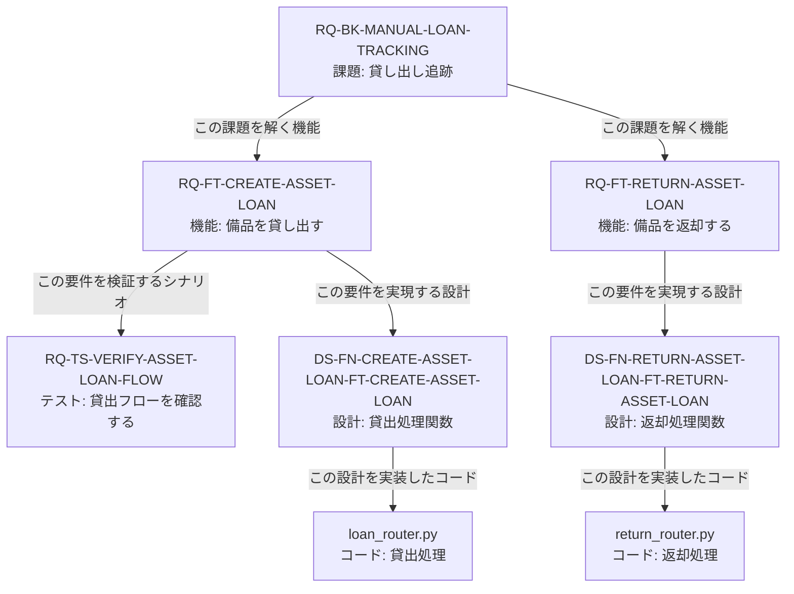
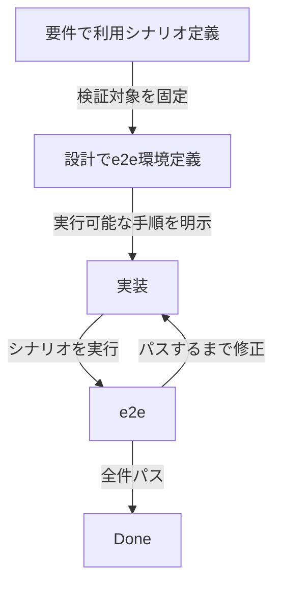

# 対話駆動仕様開発 isdd: 非エンジニアが要件を握って、堅実に動くソフトを作る

## はじめに

AI実装で一番つらいのは、速く作れることではなく、**後で壊れること**です。

- 要件が曖昧なまま実装が進む
- 変更時に影響範囲が追えない
- 「とりあえず動いた」コードが技術負債になる

isdd（Interview-driven Spec-driven Development）は、この問題を「要件 -> 設計 -> コード」をIDでつなぐことで解決します。

リポジトリ: https://github.com/notfolder/req-spec-driven  
特に参照: https://github.com/notfolder/req-spec-driven/blob/main/.apm/README.md

本記事の主張は明確です。

- 非エンジニアは、**要件定義書**をしっかり確認する
- 設計書は画面イメージ（画面遷移とUI）**だけ**を確認する
- 実装はAIに任せつつ、IDトレーサビリティとe2eで品質を担保する

これにより、バイブコーディングで技術負債を増やすのではなく、**非エンジニアでもしっかりしたソフトを作れる状態**を作れます。

---

## この記事で伝えること

1. isddの本質は「非エンジニアが品質判断できる構造化」にある
2. IDは連番ではなく意味スラッグで、要件・設計・コードを接続する
3. e2eシナリオを要件化し、実装完了条件を明確化する
4. 実運用評価（モデル x エージェントツール）で見えた傾向を共有する

---

## isddの本質

isddは、AIを賢く使うテクニックではなく、レビュー責任を再設計する手法です。

- 要件定義書: 非エンジニアが責任を持って確認する対象
- 設計書: 非エンジニアは画面イメージと画面遷移を確認する対象
- コード: AIが生成し、IDとチェックツールで機械的に整合確認する対象

30年以上の開発経験で重視してきたのは、次です。

- 章構成で「抜け漏れ」が起きにくいこと
- 曖昧な表現を減らしてレビュー観点を固定すること
- 変更時にどこを触るか、機械的に特定できること

このため、isddでは「何を書くか」を先に固定し、モデルの賢さに依存しすぎない運用を作っています。

---

## 開発フロー

### 新規開発

### 変更開発

---

## IDトレーサビリティ（連番ではない）

isddのIDは `RQ-001` のような連番ではありません。  
意味を持つスラッグを使います。

- 要件ID: `RQ-[カテゴリ]-[内容略称]`
- 設計ID: `DS-[DSカテゴリ]-[DS内容略称]-[RQカテゴリ]-[RQ内容略称]`

例:

- `RQ-BK-MANUAL-LOAN-TRACKING`
- `RQ-FT-CREATE-ASSET-LOAN`
- `RQ-TS-VERIFY-ASSET-LOAN-FLOW`
- `DS-FN-CREATE-ASSET-LOAN-FT-CREATE-ASSET-LOAN`

### トレーサビリティのイメージ

補足:

- `RQ-BK-*`（業務課題ID）を起点に紐づける
- `RQ-FT` `RQ-UI` `RQ-EX` `RQ-TS` `RQ-NF` `RQ-DT` `RQ-OP` は最低1つの `RQ-BK-*` に紐づける
- 紐づかない要件は記述しない

---

## 非エンジニアは何をレビューすればよいか

isddでは、レビュー対象を意図的に絞ります。

### 要件定義書（必ずしっかり読む）

- 業務課題と目的が正しいか
- MVPに不要な機能が混ざっていないか
- e2eシナリオが業務操作を表しているか
- 非機能要件が現実的か

### 設計書（画面イメージ中心）

- 画面遷移が業務フローと一致しているか
- 画面イメージの入力項目・操作が想定通りか
- 利用者の操作順序に無理がないか

ここを押さえれば、コードを1行ずつレビューしなくても品質判断に参加できます。

---

## e2eをゴールにする理由

AIは、実装とテストを同時に書くと「自己採点」に寄りがちです。  
isddでは要件段階で利用シナリオを決め、設計段階でe2e環境まで定義します。

重要なのは「e2eを通す」だけでなく、

- 何をe2eと呼ぶか
- どのシナリオを必須にするか
- 何を禁止するか（簡略化逃げを防ぐ）

を要件側で明記することです。

---

## 実運用評価（モデル x エージェントツール）

GWの休み期間中、連日で利用上限まで繰り返し検証しました。  
一部は追加課金して継続評価しています。

### 評価条件

- 題材1: assets-management（備品管理・貸出管理アプリ）
- 題材2: 変更仕様（予約 + 外部DB連携: 社員情報DB）
- 題材3: ドキュメント/コメント削除後のリバースエンジニアリング
- 判定: 元仕様との整合、e2e完走、過剰実装の有無

共通指示:

- 設計とタスクファイルに従って実装
- e2e失敗時は修正を反復し、全件パスをゴールにする
- 別ブランチ実装を参照しない

### 観察結果サマリ

| モデル | エージェントツール | 所感 | 主な課題 | 総合評価 |
|---|---|---|---|---|
| Copilot auto（モデル可変） | GitHub Copilot | 生成は速い | 要件・設計がMVPからズレる場面あり（例: Streamlit化、画面分離） | △ |
| Sonnet 4.5 | Claude Code | 全体品質は高め | e2e完走したが、要件を間違えたのでイメージとずれていたが、完成度は高い | ○ |
| Haiku | OpenCode | 使えるが軽量寄り | 要件膨張、Mermaid/CRUD不足、単一サーバー前提になりやすい | △ |
| Sonnet 4.5 | OpenCode | 全体品質は高め | e2e完走まで自律で到達しないケースあり | ○ |
| GPT-5.3-Codex | OpenCode | 全体品質は高め | e2e完走まで自律で到達、意外にも一番使える感じ？ | ○ |
| GPT-5.3-Codex | Codex | 要件定義が強い | 実装段で「e2eっぽい代替」で完了主張に寄る場合あり | △ |
| GPT-5.5 | Codex | 修正反復は速い | e2e達成優先で実装簡略化に寄ることがある | △ |
| GPT-5.3-Codex | Codex | 仕様理解は高い | 疑似e2eで達成主張する挙動があり定義厳密化が必要 | △ |

### 評価から得た示唆

- claude code+sonnet以上のモデル or opencode+(sonnet以上のモデル or GPT-5.3-Codex)が良い感じ
- モデル性能差より、要件と完了条件の定義が先に効く
- IDトレーサビリティとチェックツールがないと、モデル差が品質差として露出しやすい
- 「e2e全件パス」を真に機能させるには、要件側で抜け漏れのないシナリオをユーザーが確認する必要がある

---

## APM運用とチェックツール

isddでは、配布と運用も再現可能にしています。

- 原本: `.apm/skills`
- 展開先: `.agents/skills` と `.claude/skills`
- 展開: `apm install`
- 差分監査: `apm audit`

代表的なチェック:

- `rq_integrity_checker.py`
- `rq_ds_link_checker.py`
- `trace_comment_coverage_checker.py`

AIにチェック結果を返して修正ループを回せるため、人手レビューの負荷を大きく下げられます。

---

## 過去記事からの主な差分

前提記事:

- https://qiita.com/notfolder/items/34cc12003dc7e63c45e5
- https://qiita.com/notfolder/items/3daa610f6e3d9392c344

今回の拡張:

1. 概念紹介から、isdd運用体系（ID・チェック・APM）まで具体化
2. 非エンジニアのレビュー範囲を「要件全文 + 設計の画面イメージ」に明確化
3. 連番ではないIDルールを前提に、要件・設計・コードの接続を明示
4. モデル x エージェントツールの実運用比較を追加
5. e2e完了条件の厳密化（疑似達成の防止）を明文化

---

## まとめ

本質は、**要件定義書を読めれば、非エンジニアでも品質判断に参加でき、バイブコーディングで技術負債を作るのではなく、非エンジニアがしっかりとしたソフトが作れること**です。

そのためにisddは、

- 要件と設計の章構成を固定する
- 意味付きIDで追跡可能にする
- 機械チェックで漏れを検出する
- e2eシナリオで完了条件を固定する

という仕組みを用意しています。

AIの能力差は残りますが、プロセスを設計すれば品質は安定できます。  
isddは、そのための実戦的な土台です。

---

## この記事の作成過程

- 元ネタ: isdd-対話駆動仕様開発.md
- 参照1: https://github.com/notfolder/req-spec-driven/blob/main/.apm/README.md
- 参照2: https://github.com/notfolder/req-spec-driven/blob/main/.apm/skills/isdd-common/references/id-definitions.md
- 関連記事:
  - https://qiita.com/notfolder/items/34cc12003dc7e63c45e5
  - https://qiita.com/notfolder/items/3daa610f6e3d9392c344

## Qiitaタグ案（5個）

- `仕様駆動開発`
- `要件定義`
- `生成AI`
- `AIコーディング`
- `ソフトウェア設計`
