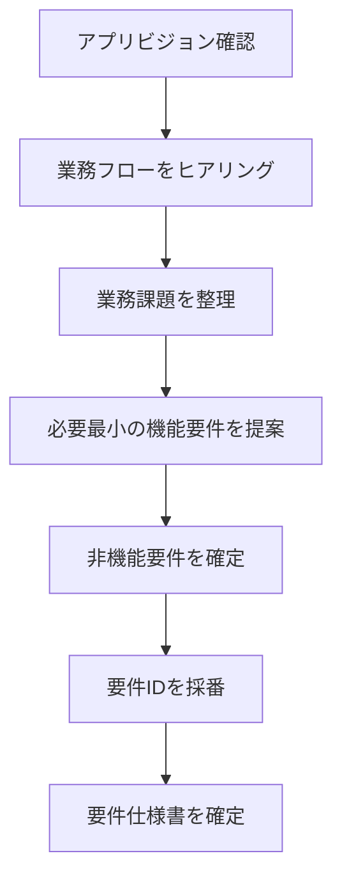
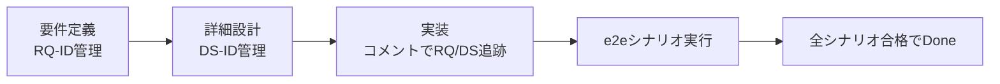
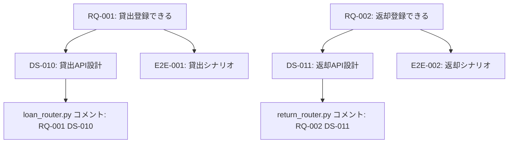
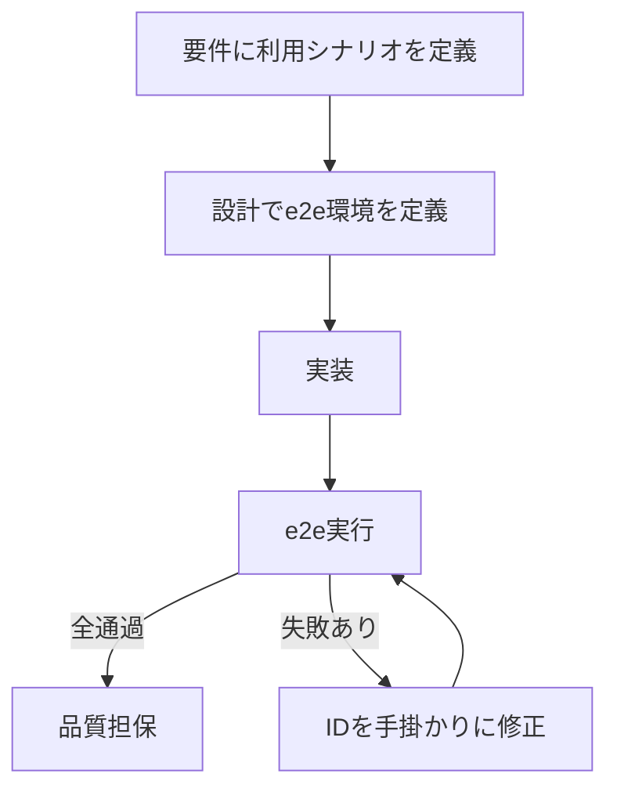

# 対話駆動仕様開発 isdd: 要件・設計・コードをIDでつなぎ、AI実装の抜け漏れを防ぐ(バイブコーディングはやめよう！！)

## はじめに

AIに実装を任せると、次の課題が頻出します。

- 要件の曖昧さから意図しない実装が混ざる
- 変更時に影響範囲を見誤って壊す
- 仕様とコードの対応関係が消え、保守が難しくなる

本記事では、これらを抑えるための **対話駆動仕様開発（isdd: Interview-driven Spec-driven Development）** を紹介します。

リポジトリ: https://github.com/notfolder/req-spec-driven  
特に参照: https://github.com/notfolder/req-spec-driven/blob/main/.apm/README.md

この記事で分かること:

- なぜ isdd が AI実装の品質を安定化できるのか
- 要件 -> 設計 -> コードをIDで接続する運用の実際
- e2eシナリオを起点に完成条件を定義する方法
- 既存記事から何が進化したか

---

## まず結論

isddのコアは次の6点です。

1. 最初に対話（ヒアリング）で要件を確定する
2. e2e用の利用シナリオを要件として先に定義する
3. 要件にID（RQ-*）を振る
4. 設計にID（DS-*）を振り、要件IDと機械的にリンク検証する
5. コードコメントにも要件ID・設計IDを残す
6. 変更時も同じ流れで差分を追跡する

これにより、AIが実装時に参照すべき意図を見失いにくくなり、実装漏れ・定義漏れ・過剰実装を減らせます。

---

## 背景: なぜ「対話駆動」なのか

従来の「バイブコーディング」では、AIが不足情報を補完してしまい、スコープ膨張や誤解を招きます。  
isddでは、最初に業務文脈を対話で収集し、次を明示します。

- コアとなるアプリビジョン
- 想定業務フロー
- 業務課題
- 最小限の機能要件
- 非機能要件

さらに、各要件に「なぜ必要か」を持たせるため、過剰な複雑化を抑えられます。

---

## isddの開発フロー

### 新規開発

### 変更開発

### 本質

- 人間は「要件の妥当性」を主に判断する
- AIは「IDリンクと実装反映」を高頻度でチェックする
- 完成条件は「e2eシナリオ全通過」で明確にする

---

## 要件・設計・コードをIDでつなぐ

isddでは、要件（RQ）と設計（DS）とコードコメントをIDで一貫接続します。

### トレーサビリティのイメージ

この形にすると、変更要求が来たときに AI が「どこを見ればよいか」を特定しやすくなります。

---

## 機械チェックを前提にした運用

isddは「AIに読ませるだけ」ではなく、チェックツールで補強します。

代表例:

- `rq_integrity_checker.py`: 要件定義内の整合性検証
- `rq_ds_link_checker.py`: 要件IDと設計IDの対応漏れ検証
- `trace_comment_coverage_checker.py`: ソースのトレーサブルコメント付与率検証

ここで重要なのは、チェック結果をAIに返し、修正ループを回せることです。  
つまり、漏れを人手で探すのではなく、ルールに沿って自動的に気づける状態を先に作る設計です。

---

## e2eシナリオを「ゴール」にする

AI実装では、実装者とテスト作成者が同一モデルになるため、ユニットテスト中心だと「自己採点」になりやすい課題があります。

isddでは次の方針を取ります。

- 要件段階で利用シナリオを定義する
- 設計段階で docker compose 前提のe2e環境まで設計する
- 実装段階のゴールを「全シナリオ通過」に置く

これにより、ユーザーが実際に使う振る舞いを品質基準にできます。

---

## APMと評価運用で「配布」と「品質」を回す

リポジトリでは、スキル原本を `.apm/skills` で管理し、展開先を分離しています。

- 編集対象: `.apm/skills`
- 展開先: `.agents/skills` と `.claude/skills`
- 展開: `apm install`
- 差分監査: `apm audit`

さらに評価運用として、Wazaベースで各スキルを検証し、リリース前品質を確認します。

ポイント:

- スキル単位で評価資材を持つ
- 実行手順を固定し、比較可能性を保つ
- 結果を改善ループに戻す

---

## 過去2記事からの主な差分

前提記事:

- https://qiita.com/notfolder/items/34cc12003dc7e63c45e5
- https://qiita.com/notfolder/items/3daa610f6e3d9392c344

今回の記事での拡張点は次です。

1. 概念紹介中心から、**isddという運用体系**の提示へ進化
2. 「ヒアリングが重要」から、**要件・設計・コードのID追跡**を中核に明確化
3. 比較実験中心から、**機械チェック前提の実装管理**まで具体化
4. テスト議論から、**要件起点のe2eゴール設計**に一本化
5. 単発実践から、**APM配布 + 評価運用（Waza）を含む継続運用**へ拡張
6. 変更開発において、**差分をIDで追えるため壊しにくい**手順を明示

---

## 導入時の注意点

- ID体系は最初に固定し、途中で命名規則を揺らさない
- 仕様書の章構成ルールを先に決める
- 「便利そうだから追加」は禁止し、業務課題との対応を必ず確認する
- e2eシナリオは業務操作ベースで作る
- 外部連携は precheck -> research -> 設計反映の順で進める

---

## まとめ

isddは、AI開発を「うまく指示する技術」から「追跡可能な開発プロセス」へ進めるための実践です。

- 対話で要件を固める
- IDで要件・設計・コードを接続する
- 機械チェックで漏れを検知する
- e2eシナリオで完成条件を固定する

この4点をセットで回すことで、AI実装の再現性と変更耐性は大きく上がります。

---

## この記事の作成過程

- 元ネタ: [isdd-対話駆動仕様開発.md](isdd-対話駆動仕様開発.md)
- リファレンス: https://github.com/notfolder/req-spec-driven/blob/main/.apm/README.md
- 関連記事:
  - https://qiita.com/notfolder/items/34cc12003dc7e63c45e5
  - https://qiita.com/notfolder/items/3daa610f6e3d9392c344

---

## 参考文献

- https://github.com/notfolder/req-spec-driven
- https://github.com/notfolder/req-spec-driven/blob/main/.apm/README.md

---

## Qiitaタグ案（5個）

- `仕様駆動開発`
- `要件定義`
- `AIコーディング`
- `生成AI`
- `ソフトウェア設計`
