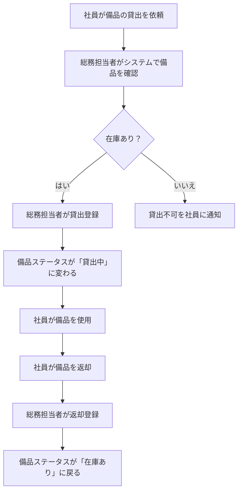

# kiro vs 自作プロンプト：仕様駆動開発で本当に大切なのは「仕様の作り方」だった

:::note
この記事は前回記事の続編です。前回は「仕様駆動開発」の概念とClaude Codeでの実践例を紹介しました。
このプロンプトで作成できるアプリの画面例などがありますので、先に前回記事を読むことをおすすめします。
→ [コードが読めなくてもAIで品質の高いソフトウェアが作れる：仕様駆動開発【Claude Code実践例】](https://qiita.com/notfolder/items/34cc12003dc7e63c45e5)
:::

## はじめに

前回の記事で「AIに要件定義書と設計書を渡せばコードは一発で動く」という話をしました。おかげさまで反響をいただき、「仕様駆動開発ツールとして話題の**kiro**とどう違うの？」という疑問が自然と湧いてきました。

そこで今回は、**同じ備品管理アプリを「kiroデフォルト」と「kiroに自作プロンプトを適用」した2つのパターンで作り比べた結果**を報告します。

結論から言うと：

- kiroデフォルト → **約1時間試行錯誤して諦めた（動かなかった）**
- kiroに自作プロンプトを適用 → **一発で動くコードが生成された**

仕様駆動開発のためのツールを使っても、**仕様の作り方が間違っていればvibeコーディングと同じ末路**になる、というのが今回の話です。

> リポジトリ（プロンプト・コード公開中）: https://github.com/notfolder/roo_code_test

---

## kiroとは

[kiro](https://kiro.dev) はAWSが提供するエージェント型IDEで、**仕様駆動開発（Spec-Driven Development）** を主要機能として掲げています。

Claude Sonnet 4.5をベースに動作し、VS Codeと互換性があります（Open VSXプラグイン対応）。

### kiroの仕様書生成フロー

kiroはプロンプトを渡すと、次の3フェーズで仕様書を自動生成します。

```
1. requirements.md — EARS形式の要件定義書
2. design.md       — 設計書（コンポーネント・API・DB設計）
3. tasks.md        — 実装タスク一覧
```

そしてそのtasksをエージェントに実行させてコードを生成します。

### EARS記法とは

kiroの要件定義書の特徴は **EARS（Easy Approach to Requirements Syntax）記法** です。

```
WHEN [条件/イベント] THE SYSTEM SHALL [期待される振る舞い]
IF [条件] THEN THE [モジュール名] SHALL [振る舞い]
```

例：
```
WHEN Admin が備品名・カテゴリ・数量・管理番号を入力して登録操作を行う,
THE Equipment_Registry SHALL 備品情報をシステムに保存し、一意の管理IDを付与する

IF 同一管理番号の備品がすでに存在する,
THEN THE Equipment_Registry SHALL 重複エラーメッセージを返し、登録を中断する
```

この記法はkiroのドキュメントによると「各要件を直接テストケースに変換できる」という利点があります。つまり、**AIには読みやすく、テスト自動生成にも適した形式**です。

ただし、後述しますが「人間がレビューしやすい」という観点では別の話になります。

:::note warn
**「ドラフトを叩き台にしてイテレーションすればいいのでは？」という疑問について**

kiroの設計思想として「まずドラフトを生成し、ユーザーが修正しながらイテレーションする」という考え方があります。しかし、**そもそも「何を修正すればいいか」を判断できるのはエンジニアだけ**です。仕様書を見て「この `Loan_Manager SHALL` という記述は自分の想定と違う」と気づくには、ある程度の技術的素養が必要です。

一方、プロンプトでヒアリングを進める方法は、AIが1問ずつ平易な言葉で質問するため、**非エンジニアでも答えられます**。「返却期限の通知は必要ですか？」と聞かれれば、誰でも「いらない」と答えられます。叩き台を修正するより、質問に答える方が圧倒的に参入障壁が低いのです。
:::

---

## 実験：同じアプリを2パターンで作り比べる

**お題**：前回記事で作った備品管理・貸出管理アプリを、kiroで作り直す

| | パターン1 | パターン2 |
|---|---|---|
| 方法 | kiroデフォルト使用 | kiroに自作プロンプトを適用 |
| ブランチ | [feature-dev-asset-management-plain-kiro](https://github.com/notfolder/roo_code_test/tree/feature-dev-asset-management-plain-kiro) | [feature-dev-asset-management-kiro-my-prompt](https://github.com/notfolder/roo_code_test/tree/feature-dev-asset-management-kiro-my-prompt) |
| 結果 | **動かなかった（1時間で諦め）** | **一発で動作** |

---

## パターン1：kiroデフォルトで挑戦 → 失敗

### kiroに一言伝えると…仕様書が勝手に生成される

kiroに次のように伝えました。

```
備品管理・貸出管理アプリを作りたい
```

kiroは**質問を一切せず**、この一言から自動でEARS形式の要件定義書を生成しました。

生成された要件の一覧：

| 要件番号 | 内容 |
|---------|------|
| 要件1 | 備品の登録・管理 |
| 要件2 | 備品の検索・一覧表示（ページネーション付き20件/ページ） |
| 要件3 | 備品の貸出申請（1ユーザーあたり同時最大5件制限） |
| 要件4 | 備品の返却処理 |
| 要件5 | 貸出履歴の確認 |
| **要件6** | **返却期限超過の通知（メール通知・日次バッチ）** |
| **要件7** | **備品ステータス管理（メンテナンス中ステータス）** |

赤字の要件6・7は**こちらが一切要求していない機能**です。

- 「通知メール」なんて頼んでいない
- 「メンテナンス中ステータス」も要件ではなかった
- 貸出に「返却予定日」が必要という前提になっているが、要求していない

kiroは「貸出管理アプリなら通知もいるだろう」と勝手に補完してしまいます。

:::note warn
**「提案として有用では？」という疑問について**

「削除すればいいだけ」という意見もありますが、問題は要件定義書に書かれた機能が**そのまま設計書・実装に連鎖する**点です。実際に今回の検証では、要件の修正をしたにもかかわらず設計フェーズで不要な機能が残り続けました。

もし「通知が必要か」という提案をしたいなら、**要件定義書の中に「提案事項」として明記した上でユーザーに確認を求める**べきです。質問なしに仕様書に組み込んでしまうのは提案ではなく、勝手な仕様追加です。仮に仕様書に書かれていてユーザーが見落としたとすれば、それはEARS形式が読みにくいことの証左でもあります。
:::

### EARS形式の仕様書は人間にとって難解

生成された要件定義書を一部引用します。

```markdown
**受け入れ基準**

1. WHEN Admin が備品名・カテゴリ・数量・管理番号を入力して登録操作を行う,
   THE Equipment_Registry SHALL 備品情報をシステムに保存し、一意の管理IDを付与する
2. IF 申請対象の備品の Equipment_Status が「貸出中」または「メンテナンス中」である,
   THEN THE Loan_Manager SHALL 貸出不可メッセージを返し、申請を中断する
3. THE Loan_Manager SHALL 1ユーザーあたり同時に最大5件までの貸出を許可する
4. WHILE 備品の Equipment_Status が「貸出中」である,
   THE Equipment_Registry SHALL Admin によるステータス変更操作を受け付けない
```

`Equipment_Registry`、`Loan_Manager`、`Search_Engine`、`Notification_Service` — これはモジュール名です。仕様書の段階から実装の都合が入り込んでいます。

AIには読みやすい（モジュール境界が明確）かもしれませんが、**仕様書を人間が読んで「自分が作りたいものと合っているか」をレビューするのは難しい**です。

:::note warn
**「エンジニア向けツールならEARS形式で当然では？」という疑問について**

kiroはエンジニア向けツールとして設計されており、EARS形式はその文脈では合理的です。しかし本記事の主張は「前回記事のアプローチは**非エンジニアでもソフトウェア開発の発注者になれる**」という点にあります。エンジニアが使うツールではなく、**業務担当者が自分でソフトウェアを作れるようにすること**を目標にしているため、仕様書は非エンジニアが読んでレビューできる形式である必要があります。kiroは対象ユーザーが異なるツールだ、と言えます。
:::

さらに設計書では TypeScript の interface 定義が含まれていました。

```typescript
interface Equipment {
  id: string;         // UUID
  assetNumber: string; // 管理番号（一意）
  name: string;
  category: string;
  quantity: number;
  status: EquipmentStatus;
  createdAt: Date;
  updatedAt: Date;
}

enum EquipmentStatus {
  AVAILABLE = "利用可能",
  ON_LOAN   = "貸出中",
  DISPOSED  = "廃棄済み",
}
```

実装言語も決めていないのに、仕様書にTypeScriptが出てきます。

### 修正して実装へ → 動かない

要件定義書を見て、不要な機能（通知サービス、スケジューラ等）を削除し、自分がやりたい内容と異なる条件の修正をしました。

ただし、**kiroのデフォルトの仕様書には「目次の構成が充分でない」という問題**がありました。これにより、仕様の充分性チェック自体が不十分な状態で実装フェーズに進むことになりました。

実装後に起きたこと：

1. **ビルドが通らない** → エラーを貼り付けて修正を依頼
2. **ポート番号が衝突** → 修正してもらう
3. **画面は表示されるがフロントエンドがバックエンドを一切呼び出していない** → 修正を依頼
4. **呼び出すようになったがバックエンドのAPI内でエラー** → 修正を試みるが解決できず

**約1時間試行錯誤して修正を断念しました。**

:::note
**サンプルサイズについての注記**

「検証が1件では結論として早計では？」という点はその通りです。今後も同様の検証を複数回行い、結果を追記する予定です。現時点では「少なくともこのケースでは失敗した」という事実として受け取っていただければと思います。
:::

コミットログにも当時の苦労が記録されています：

```
"実装完了とのことだが、起動しない。"
"ユーザー作ってくれたけど、そもそもフロントがバックエンド呼び出していなかった"
"fix(frontend): Add API path rewriting to remove /api prefix in proxy"
```

最後まで動作する状態には至りませんでした。

---

## パターン2：kiroに自作プロンプトを適用 → 一発で動作

### やり方：kiroのchatにプロンプトを貼り付ける

前回記事で公開した [REQUREMENTS_DEFINITION_AGENT.md](https://github.com/notfolder/roo_code_test/blob/main/agents/REQUREMENTS_DEFINITION_AGENT.md) の内容を、**kiroのchatに直接貼り付けて**、そのプロンプトに従って動いてもらいました。

要は、*kiroを「AIエージェントの実行エンジン」として使い、仕様書をどう作るかは自作プロンプトで制御する* ということです。

:::note
**「2回目だから成功しただけでは？」という疑問について**

自作プロンプトは前回（Claude Code版）から変更していません。また、前回のコンテキスト（会話ログや生成物）は一切渡していません。kiroは前回の開発経験を知らない状態で、純粋に自作プロンプトだけを渡して検証しています。同じプロンプトをkiroに渡すだけで同じ結果が再現できたという事実が、プロンプト自体の汎用性を示しています。
:::

### kiroが質問してくるようになった

自作プロンプトを渡すと、kiroは**黙って仕様書を書かず、必要な情報を1問ずつ質問してきます**。

```
質問1：このアプリを使う目的を教えてください。
→ 社内の備品（PC・プロジェクター等）の貸出状況を把握したい

質問2：誰がどんな操作をしますか？
→ 総務担当者：貸出・返却登録、備品管理
   一般社員：一覧閲覧のみ

質問3：ステータスは何種類必要ですか？
→ 「在庫あり」「貸出中」の2種類だけでいい

...（以下続く）
```

質問を通じて「返却予定日は不要」「通知機能は不要」「最大貸出件数の制限は不要」ということが明確になります。

### 生成された要件定義書は人間が読みやすい

生成された要件定義書の機能一覧を見てください。

| # | 機能カテゴリ | 機能名 | この機能が無いと何が困るか |
|---|------------|--------|--------------------------|
| F-01 | マスタ管理 | 備品登録 | 管理対象備品をシステムに登録できない |
| F-02 | マスタ管理 | 備品編集 | 備品名の誤りを修正できない |
| F-03 | マスタ管理 | 備品削除 | 廃棄した備品をシステムから除去できない |
| F-04 | 業務機能 | 貸出登録 | 誰が借りているか記録できない |
| F-05 | 業務機能 | 返却登録 | 返却後もステータスが「貸出中」のままになる |
| F-06 | 業務機能 | 備品一覧表示 | 現在の在庫状況を確認できない |
| F-07 | 共通 | ログイン | 誰でも貸出・返却操作ができてしまう |
| F-08 | 共通 | ログアウト | セッションを終了できない |
| F-09〜F-12 | マスタ管理 | ユーザー管理 | アクセス制限ができない |

**「この機能が無いと何が困るか」** の列が重要です。前回記事で紹介した「曖昧な要件を排除するためのプロンプトのポイント」がここに効いています。

さらに、画面ごとの仕様も生成されます：

```markdown
#### SC-01 ログイン画面
- 入力項目：ログインID、パスワード
- 操作：ログインボタン
- バリデーション：未入力時はエラーメッセージを表示する
- 認証失敗時：「IDまたはパスワードが正しくありません」を表示する

#### SC-02 備品一覧画面
- 表示項目：管理番号、備品名、ステータス（在庫あり／貸出中）、借用者名（貸出中の場合のみ）
- 総務担当者向け操作：備品登録ボタン、編集ボタン・削除ボタン・
  貸出ボタン（在庫ありの場合のみ活性）・返却ボタン（貸出中の場合のみ活性）
- 一般社員向け操作：なし（閲覧のみ）
```

これは**非エンジニアでも読んでレビューできる**仕様書です。

### 業務フロー・画面遷移図も生成される



### 設計書→実装→一発で動作

設計書も同様に自作プロンプト（[DESIGN_SPEC_AGENT.md](https://github.com/notfolder/roo_code_test/blob/main/agents/DESIGN_SPEC_AGENT.md)）をkiroのchatに貼り付けて生成。その後 `実装して` とchatに指示するだけで、**一発で動作するコードが生成されました**。

起動方法も README にきれいにまとめられています：

```bash
docker compose up --build
# → http://localhost:8080 でアクセス可能
```

---

## 2つの仕様書を比較する

### 要件定義書の比較

| 観点 | kiroデフォルト | kiro + 自作プロンプト |
|------|---------------|----------------------|
| 情報収集 | 質問なし（自動生成） | ユーザーに質問して収集 |
| 記述形式 | EARS（WHEN/IF/THEN + モジュール名） | 自然言語＋表形式 |
| スコープ | 膨張（通知・スケジューラ等が混入） | 必要な機能のみ（12機能） |
| 画面仕様 | なし | 各画面の入出力・バリデーション定義あり |
| 非エンジニアがレビューできるか | 難しい | できる |
| 結果 | 動かなかった | 一発で動作 |

### EARS形式 vs 自然言語形式の例

同じ「貸出登録」機能の記述：

**kiroデフォルト（EARS形式）**：
```
WHEN User が利用可能な備品に対して貸出申請を行う, 
THE Loan_Manager SHALL Loan_Record を作成し、
対象備品の Equipment_Status を「貸出中」に変更する

IF 申請対象の備品の Equipment_Status が「貸出中」または「メンテナンス中」である,
THEN THE Loan_Manager SHALL 貸出不可メッセージを返し、申請を中断する

THE Loan_Manager SHALL 1ユーザーあたり同時に最大5件までの貸出を許可する
```

**自作プロンプト（自然言語＋画面仕様）**：
```
#### SC-05 貸出登録画面
- 表示項目：管理番号、備品名（変更不可）
- 入力項目：借用者名（必須）
- 操作：貸出登録ボタン、キャンセルボタン
- バリデーション：未入力チェック
```

EARS形式は「テスト可能性」を重視していますが、**人間が「これは自分が作りたいものか」を確認しやすいのは自然言語の画面仕様**です。

---

## なぜkiroデフォルトは失敗したのか

根本的な問題は2つあります。

### 問題1：不十分な情報で仕様書を生成してしまう

kiroは最初のプロンプト一言から仕様を生成します。情報が不足していても「きっとこういうものが必要だろう」と補完します。

- 通知メールが必要かどうか → 聞かずに実装
- 返却予定日が必要かどうか → 聞かずに実装
- 最大貸出件数の制限が必要かどうか → 聞かずに実装

これらの「勝手な補完」が設計・実装に連鎖して、最終的に動かないコードになります。

### 問題2：仕様書の目次が充分でないため、仕様の充分性チェックができない

kiroのEARS形式仕様書には、前回記事で紹介した要件定義書のような：

- 業務フロー
- 画面一覧と各画面の仕様
- データ設計とCRUD定義
- 非機能要件

といった**セクション構造がありません**。

仕様書に「画面仕様」がないということは、「この画面はどんな入力項目があるべきか」という情報が設計フェーズまで曖昧なままです。AIは推測で実装するしかなく、フロントエンドとバックエンドの連携が壊れます。

---

## まとめ

| | kiroデフォルト | kiro + 自作プロンプト | Claude Code + 自作プロンプト（前回記事） |
|---|---|---|---|
| 要件収集 | 自動（質問なし） | 質問あり | 質問あり |
| 仕様形式 | EARS（AI向け） | 自然言語（人間向け） | 自然言語（人間向け） |
| スコープ管理 | 膨張しやすい | 必要なものだけ | 必要なものだけ |
| 結果 | 動かなかった | 一発動作 | 一発動作 |

kiroは「仕様駆動開発の元祖」として素晴らしいコンセプトを持っています。しかし：

> **仕様駆動開発のツールを使うだけでは不十分。「どのように仕様を作るか」のプロセスが正しくないと、最終的にvibeコーディングと同じ末路になる。**

これが今回の検証で得た最大の学びです。

:::note warn
**「それはkiroの問題ではなく使い方の問題では？」という疑問について**

ある意味その通りです。kiroは正しく使えば強力なツールです。ただし**「正しい使い方」自体をユーザーが知っていなければならない**という点が問題です。

kiroのドキュメントには「requirements.mdを自分で修正してイテレーションせよ」と書かれていますが、何をどう修正すれば良い仕様書になるかを知っているのはエンジニアだけです。本記事の自作プロンプトは、その**「正しい使い方」をプロンプトとして言語化・構造化したもの**です。

- 「必要な情報をヒアリングで集める」
- 「各要件に根拠（この機能がないと何が困るか）を付ける」
- 「画面仕様まで落とし込む」
- 「将来拡張・ベストプラクティスを勝手に追加しない」

これらのルールをプロンプトに組み込むことで、エンジニアでなくても、kiroを含む**どのAIツールでも「正しい使い方」ができるようになります**。ツールの設計思想を正しく補完するプロンプト、それが今回公開した成果物です。
:::

逆に言えば、**適切なプロンプトさえあれば、kiroでもClaude Codeでも、どのAIツールでも同じ結果が得られる**ということでもあります。今回使ったプロンプトはkiroのchatに貼り付けるだけで機能しました。

---

## 今後の課題

現在公開しているプロンプトにはまだ足りない点があります。今後対応したいと考えていること：

- **既存コードからの設計書・仕様書リバースエンジニアリング**
- **E2Eテスト自動生成**（要件定義時にシナリオを作成、GUIはPlaywright＋Docker Composeで強制）
- **社内環境情報の取り込み**（プロキシ、証明書等を要件定義書・設計書に反映）
- **外部システム・DB連携**（MCPを使ってOpenMetaDataやAPI仕様書ストアから仕様を取得）
- **ログ設計の要件・設計への組み込み**

プロンプトはリポジトリに公開していますので、ぜひ試してみてください。改善提案も歓迎です。

https://github.com/notfolder/roo_code_test

---

## この記事で紹介したリポジトリ

| ブランチ | 内容 |
|---------|------|
| [feature-dev-asset-management-plain-kiro](https://github.com/notfolder/roo_code_test/tree/feature-dev-asset-management-plain-kiro) | kiroデフォルトで生成した動かないコード |
| [feature-dev-asset-management-kiro-my-prompt](https://github.com/notfolder/roo_code_test/tree/feature-dev-asset-management-kiro-my-prompt) | 自作プロンプト適用で一発動作したコード |

---

**Tags**: `kiro` `AI` `仕様駆動開発` `要件定義` `Claude` `LLM` `ソフトウェア開発`
