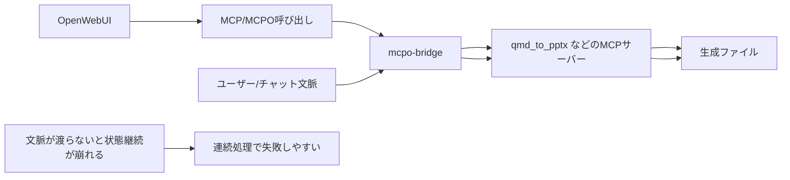
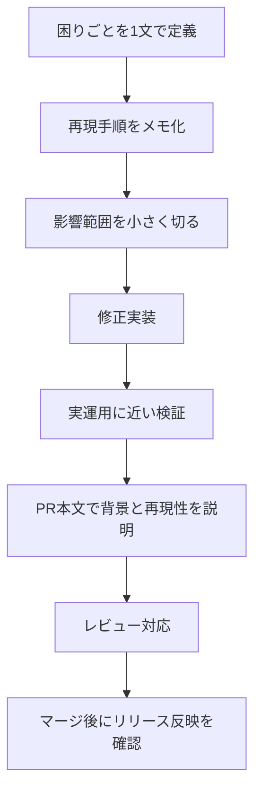
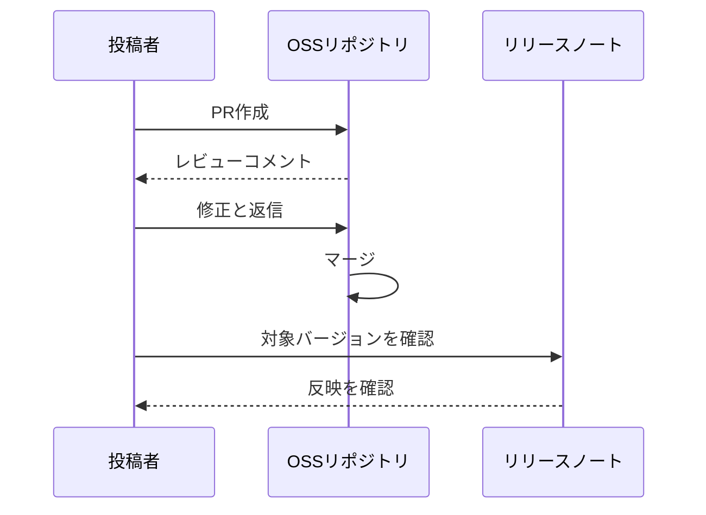

# 初学者でもできるOSS貢献: OpenWebUIへの小さなPRがリリースに入るまで

## はじめに
今回のモチベーションはシンプルでした。  
OpenWebUIはMarkdownをきれいにプレビューできるので、「このままPPTも自動で作れないか？」と考えたことが出発点です。

そこで、OpenWebUI + MCPでファイル生成フローを構成し、最終的にPPTXを作る運用を試しました。  
その過程でOpenWebUI本体に必要な機能が不足していることが分かり、PRを作成して取り込まれるまでを進めました。

対象リポジトリ:
- https://github.com/open-webui/open-webui
- https://github.com/notfolder/mcpo-bridge
- https://github.com/notfolder/qmd_to_pptx

## この記事でわかること
- 初学者がOSS PRを作るときの現実的な進め方
- 「最小変更でも価値がある」を成立させるチェック観点
- MCPとセッション周りでつまずきやすい点のやさしい整理

## 用語メモ（初学者向け）
- QMD: Quarto Markdownのこと。Markdownを拡張した文書形式で、スライドやレポートを生成しやすい。
- PPTX: PowerPointファイル形式（.pptx）。
- MCP: Model Context Protocol。LLMアプリと外部ツールをつなぐための共通プロトコル。
- JSON-RPC 2.0: MCPメッセージの土台になる通信形式。リクエスト/レスポンス/通知の形でやり取りする。
- セッション: 文脈によって意味が違う。
  ここでは「同じユーザーの同じ作業を複数リクエストで継続するための状態管理」を指す。

## 背景: なぜこの修正が必要だったか
実現したかったのは、次の流れです。

1. OpenWebUI上でMarkdownベースの内容を作る
2. qmd_to_pptxでPPTXに変換する
3. 複数ステップのファイル生成処理を安定して完走させる

ここで重要だったのが、qmd_to_pptxを汎用的に作っている点です。  
qmd_to_pptx自体は「ユーザー/チャット単位のセッション状態を持つ前提」で作っていません。

つまり、サーバー単体では「誰のどの会話の処理か」を保持しない設計です。  
このギャップを埋めるために、mcpo-bridge側でセッション管理を担う必要がありました。

## MCPプロトコルを整理
MCPは、LLMアプリとツールを標準化された形で接続するためのプロトコルです。  
メッセージはJSON-RPC 2.0でやり取りされます。

混乱しやすいポイントは、「MCPにセッションがあるのか」です。

1. MCPはツール呼び出しの共通ルールを定義する
2. ただし「アプリ固有の会話IDをどう扱うか」は標準で固定されない
3. OpenWebUIには独自の通信上のセッション管理がある
4. それでも、OpenWebUIのユーザー/チャット文脈をそのまま下流に渡す設計は実装側の責務

今回必要だったのは4です。  
なので、mcpo-bridgeでOpenWebUI由来の文脈を扱えるように設計し、OpenWebUI側にも必要な情報を渡す機能追加が必要でした。

## 問題の全体像

ポイントは「必要なヘッダが意図した経路で落ちる」のではなく、当時のOpenWebUIにその機能がなかったことです。  
そのため、機能を追加するPRを作成しました。

## 失敗と修正
### 失敗
OpenWebUIからMCP呼び出し時に必要ヘッダが付かず、セッション継続が崩れた。

### 原因
OpenWebUIに必要なヘッダ付与機能がなかった。  
加えて、検証中に「AIが示したコード上の呼び出し経路以外にも修正が必要な箇所」が見つかった。

### 修正
ヘッダ転送の実装を追加し、見落としていた経路も含めて修正。  
その後、実際のファイル生成フローで再検証した。

## 初学者向け: PR作成フロー
自分が実際にやって有効だった流れを、再利用しやすい形にします。

## PR作成時のチェック観点
「最小変更でも価値がある」を成立させるために、次を明文化しておくと通しやすいです。

1. 課題が利用者目線で説明できるか
2. 再現手順が第三者に伝わるか
3. 変更が最小で、影響範囲を把握しているか
4. 実運用に近い検証をしているか
5. なぜ今この修正が必要かを説明できるか
6. マージ後の確認ポイントがあるか

## 実際のPRとリリース確認
- PR: https://github.com/open-webui/open-webui/pull/21092
- 取り込み確認: https://github.com/open-webui/open-webui/releases/tag/v0.8.4

確認の流れは次の通りです。

## 検証環境
- macOS 25.x
- Docker Desktop 4.72.0
- OpenWebUI v0.6.43系
- Python 3.11

## 補足: mcpo-bridge / qmd_to_pptxとの関係
### qmd_to_pptxの役割
qmd_to_pptxは、QMD/Markdownから編集可能なPPTXを生成するツールです。  
ライブラリとしてもMCPサーバーとしても使えるように作られています。

この設計は汎用的ですが、逆に言うと「OpenWebUIの会話単位の状態」を前提にしていません。  
そのため、連続処理の状態管理は外側の仕組みで補う必要があります。

### mcpo-bridgeの役割
mcpo-bridgeは、この状態管理を担うためのブリッジです。  
ファイル生成系ツールのように複数リクエストで状態を引き継ぐケースで、ユーザー/チャット文脈に応じた処理継続を実現します。

### OpenWebUI側の役割
OpenWebUIから下流へ必要な文脈情報を渡せないと、ブリッジが状態を正しく結びつけられません。  
今回のPRは、この不足していた機能を追加して、全体フローを成立させるためのものでした。

## 学び
- 初回OSS貢献は、大きい変更より明確な課題設定が重要
- AIは強力だが、呼び出し経路や影響範囲は人間の最終確認が必須
- 最小変更でも、下流の実利用を支えるなら十分に価値がある

## 限界と注意点
- 本記事は特定バージョン時点の検証であり、将来のOpenWebUI実装変更で前提が変わる可能性があります
- セキュリティ境界やネットワーク構成によって、同じ設定でも挙動が異なる場合があります
- すべてのMCPサーバー構成を網羅した検証ではありません

## 次に試すこと
1. 自分の利用ケースで、困りごとを1文で定義してみる
2. 再現手順と期待結果を箇条書きで作ってから修正する
3. マージ後にリリースノートまで追跡して成果を確認する

## 参考リンク
- OpenWebUI PR: https://github.com/open-webui/open-webui/pull/21092
- OpenWebUI release v0.8.4: https://github.com/open-webui/open-webui/releases/tag/v0.8.4
- mcpo-bridge: https://github.com/notfolder/mcpo-bridge
- qmd_to_pptx: https://github.com/notfolder/qmd_to_pptx
- MCP Specification: https://modelcontextprotocol.io/specification/2025-03-26
- MCP Transport (Streamable HTTP): https://modelcontextprotocol.io/specification/2025-03-26/basic/transports

## Qiitaタグ案
- OpenWebUI
- MCP
- OSS
- 初心者
- Python
