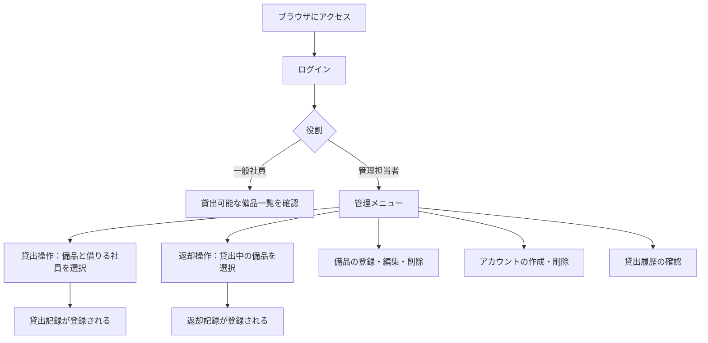
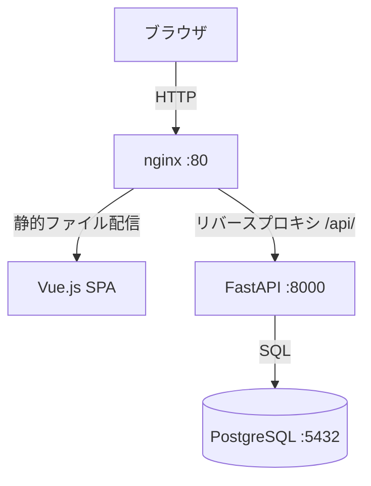
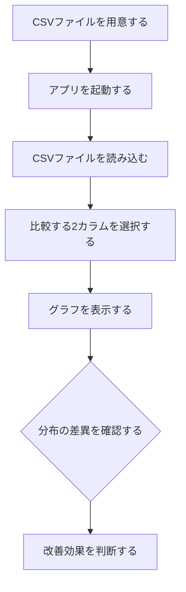
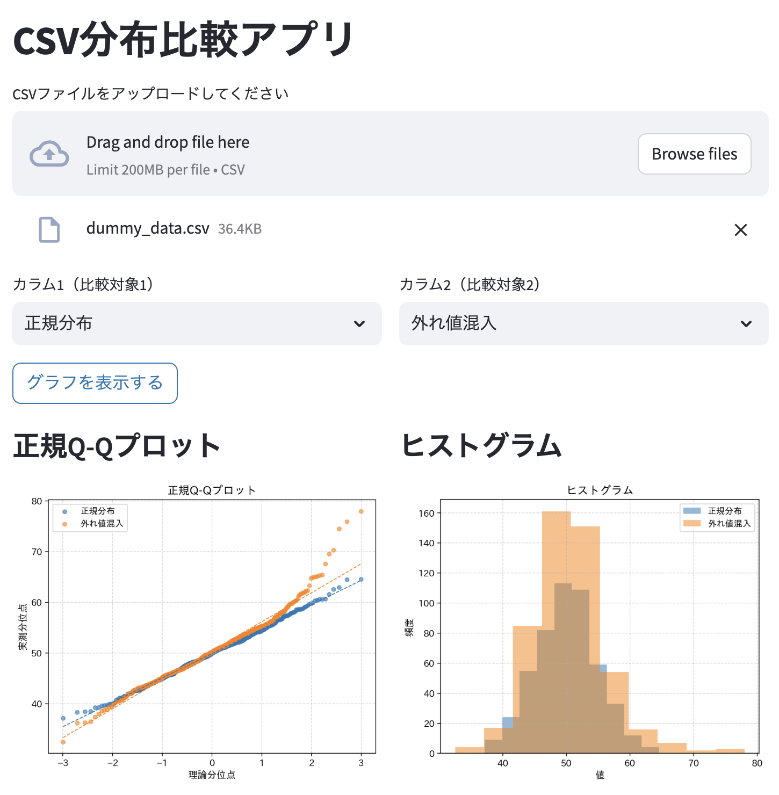

# AIが「サボる」「壊す」を解決する：要件定義書ドリブン開発でメンテできるコードを作る【Claude Code実践例】

## はじめに

AIコーディングツールを使って開発していて、こんな経験はありませんか？

> 「機能を追加してもらったら、既存機能まで壊れてずっと直せなくなった」

筆者も同じ失敗をしました。「XXXを作って」と伝えて動くものができたのはいいのですが、不足機能を追加してもらったら既存機能が壊れ、そのままずっと直せない状態になってしまいました。

この記事では、30年のソフトウェア開発経験を元に辿り着いた解決策、**「要件定義書ドリブン開発」** を紹介します。

> リポジトリ（要件定義・設計書用プロンプト公開中）: https://github.com/notfolder/roo_code_test

## なぜAIは「壊す」のか？

AIは人間のエンジニアと同じように、**サボる・勘違いする** という特性を持っています。

具体的には：
- 要件が曖昧だと、AIが「きっとこういう意味だろう」と勝手に解釈してコードを書く
- 後から「あの機能も追加して」と言うと、最初の設計意図を無視して上書きする
- コードをプレースホルダや`TODO`のままにして「完成」と報告する（サボり）

人間のエンジニアが同じことをしたら、あなたはどう対処しますか？

**「仕様書に書いてください」** と言うはずです。

AIにも同じことをすればいいのです。

## 解決策：ウォーターフォールでAIを「管理」する

解決策はシンプルです。古典的なウォーターフォール開発をAIに適用します。

```
要件定義書 → 設計書 → コード
```

「世の中では設計ドリブンと言うけど、要件定義書でよくない？」と思ったのが本手法の出発点です。

### なぜウォーターフォールがAIに合うのか

- **改良しやすい**: 要件定義書を直せばコードも直せる。仕様変更の影響範囲が明確
- **サボりが減る**: 要件定義書に書いてあることはコードに書く。曖昧な余白がない
- **スピードはアジャイルに負けない**: AIなら1時間以内で要件定義書・設計書・コードができる

アジャイルを経験してきた筆者の結論として、**AIと開発するならウォーターフォールの方が合っている** と感じています。

## 使用ツールと公開プロンプト

**ツール**: VS Code + Claude Code v2.1.86

GitHubに以下のプロンプトを公開しています。

| ステップ | プロンプト |
|---------|----------|
| 要件定義 | [REQUREMENTS_DEFINITION_AGENT.md](https://github.com/notfolder/roo_code_test/blob/main/agents/REQUREMENTS_DEFINITION_AGENT.md) |
| 設計書 | [DESIGN_SPEC_AGENT.md](https://github.com/notfolder/roo_code_test/blob/main/agents/DESIGN_SPEC_AGENT.md) |
| コード生成 | 要件定義書と設計書を渡して「この要件定義書と設計書を元にコードを書いて」と指示するだけ |

プロンプトのポイントは、30年の開発経験で培った「専門家だけど勘違いしやすかったり、サボったりする人と中規模開発をするときのノウハウ」を詰め込んでいること。たとえば：

- 各要件に「この要件が無いと何が困るか」を明示させる（曖昧な要件の排除）
- 将来拡張・一般論・ベストプラクティスは記述しない（スコープ膨張の防止）
- 不足情報があればユーザーに質問し、完全になるまで終了しない（サボり防止）

## 実践例1：備品管理・貸出管理アプリ（所要時間：約58分）

### ステップ1：ヒアリング → 要件定義書

Claude Codeに `REQUREMENTS_DEFINITION_AGENT.md` を読ませ、以下のように伝えます。

```
備品管理・貸出管理アプリを作りたい。
要件定義書を作るのに必要な情報を質問して要件定義書を作って
```

するとAIが必要な情報を1問ずつ質問してきます。

```
質問1：このアプリを使う目的・背景を教えてください。
→ 社内の備品をどこの誰が使っているか把握したい

質問2：備品の種類は何種類くらいを想定していますか？
→ ...
```

全ての質問に答えると、AIがMermaid図入りの要件定義書を自動生成します。

#### 業務フロー(例)



### ステップ2：要件定義書 → 設計書

次に `DESIGN_SPEC_AGENT.md` を読ませ、生成した要件定義書を渡します。

AIはシステム構成（言語・フレームワーク・DB設計・クラス設計など）を含む設計書を生成します。特段の理由がなければ：

- GUIが必要: **Python + Streamlit**
- 複雑な画面: **Vue (Vuetify) + FastAPI**（フロントはNginx、Docker Compose構成）

で設計されます。

#### システム構成図(例)



### ステップ3：設計書 → コード

設計書ができたら、あとはシンプルです。

```
この要件定義書と設計書を元にコードを書いて
```

Claude Codeが要件定義書・設計書に従って完全なコードを生成します。


**結果**: 要件定義書の作成開始から動くアプリの完成まで **約58分**。

[生成したプログラムのあるブランチ](https://github.com/notfolder/roo_code_test/tree/feature-dev-claude-asset-management)

## 実践例2：CSVデータ分布比較アプリ（所要時間：約41分）

品質管理担当者向けに、改善前後のデータをCSVで読み込んで正規Q-Qプロットとヒストグラムで比較表示するアプリを開発しました。

同じ流れで：
1. AIがヒアリング（「シグマプロットは正規Q-Qプロットのこと？」などを確認）
2. 要件定義書生成
3. 設計書生成（Streamlit + matplotlibの構成）
4. コード生成

**結果**: 開始から動くアプリの完成まで **約41分**。

### 業務フロー(例)





[生成したプログラムのあるブランチ](https://github.com/notfolder/roo_code_test/tree/feature-dev-sigmaplot)

### 要件定義書があると「サボり」が激減する

この手法を使う前は、AIがコードの一部を `# TODO: implement` などのプレースホルダにして「完成」と報告することがありました。

要件定義書ドリブンにすると、「要件定義書のXXX機能はどこに実装されているか？」という明確なチェックができるため、サボりが大幅に減りました。

## まとめ

| | 従来（曖昧な指示） | 要件定義書ドリブン |
|---|---|---|
| メンテ性 | 機能追加で既存機能が壊れる | 要件定義書を修正すれば対応可 |
| サボり | プレースホルダが残る | 要件定義書に沿った実装を強制 |
| 開発速度 | 速いが後で詰まる | 1時間以内で完成、後工程も楽 |
| 改良のしやすさ | 壊し続ける | 要件定義書が改良の起点になる |

AIは優秀ですが、**枠をはめないと勝手な解釈でコードを書きます**。30年前から人間のエンジニアに通用してきた「ちゃんと仕様書を書いてから作る」というやり方は、AIにも有効です。

要件定義書・設計書用のプロンプトはすべて公開していますので、ぜひ試してみてください。

https://github.com/notfolder/roo_code_test

## この記事の作成過程

この記事に登場した2つのアプリはすべてClaude Codeとの実際のセッションで開発されました。

- [備品管理・貸出管理アプリの開発セッション](https://github.com/notfolder/roo_code_test/blob/main/claude_session_%E5%82%99%E5%93%81%E7%AE%A1%E7%90%86%E8%B2%B8%E5%87%BA%E7%AE%A1%E7%90%86%E3%82%A2%E3%83%97%E3%83%AA.md)
- [CSVデータ分布比較アプリの開発セッション](https://github.com/notfolder/roo_code_test/blob/main/claude_session_CSV%E3%83%87%E3%83%BC%E3%82%BF%E3%81%AE%E5%88%86%E5%B8%83%E6%AF%94%E8%BC%83%E3%82%A2%E3%83%97%E3%83%AA.md)
