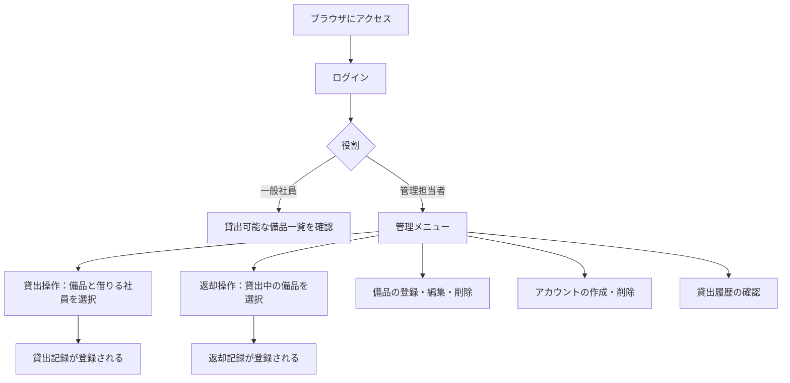
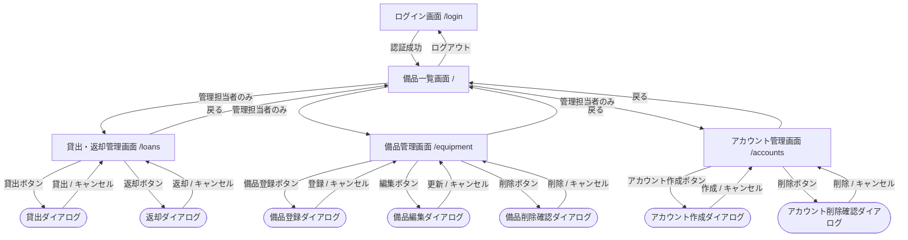
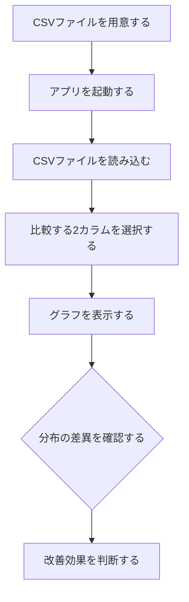

# コードが読めなくてもAIで品質の高いソフトウェアが作れる：仕様駆動開発【Claude Code実践例】

## はじめに

「AIにソフトウェアを作ってもらいたいけど、生成されたコードのレビューができない」

エンジニアでなければそもそもコードは読めませんし、エンジニアであっても、AIが短時間で大量に生成したコードを全部レビューするのは現実的ではありません。

この記事では、**コードレビューなしで、非エンジニアでも品質の高いソフトウェアをAIに作ってもらえる方法**を紹介します。キーワードは「仕様駆動開発」です。

⚠️不勉強で世の中に知られている仕様駆動開発と同じことを主張しています
　ちゃんとした仕様駆動開発の本なりを読んだ方が良いですが、
　仕様駆動開発の裾野を広げるためのプロンプトを公開しました、ということになります。

> リポジトリ（要件定義・設計書用プロンプト公開中）: https://github.com/notfolder/roo_code_test

## AIに「適当に」作らせると起きる2つの問題

### 問題1：追加・改良するたびに壊れる

「XXXを作って」と伝えて動くものができても、不足機能を追加してもらったら既存機能が壊れ、そのままずっと直せない状態になる。これはよくある失敗パターンです。

AIは人間のエンジニアと同じように、**サボる・勘違いする** という特性を持っています。

- 要件が曖昧だと「きっとこういう意味だろう」と勝手に解釈してコードを書く
- 後から「あの機能も追加して」と言うと、最初の設計意図を無視して上書きする
- コードをプレースホルダや`TODO`のままにして「完成」と報告する（サボり）

### 問題2：AIが生成したコードはレビューできない

AIがコードを生成してくれても、そのコードが正しいかどうかを確認するには、コードを読む必要があります。

- **非エンジニア**: そもそもコードが読めない
- **エンジニア**: 読めるが、AIが1時間で書いた数千行を全部レビューするのは非現実的。AIに作ってもらった意味が薄れる

コードレビューという工程が残る限り、AIを使っても「エンジニアが必要」「時間がかかる」という問題は解決しません。

## 解決策：仕様駆動開発

解決策はシンプルです。古典的なウォーターフォール開発をAIに適用します。

```
要件定義書 → 設計書 → コード
```

⚠️「世の中では設計ドリブンと言うけど、要件定義書でよくない？」と思ったのが本手法の出発点です。
　お恥ずかしい。不勉強で仕様駆動開発を勘違いしていました。全くもって仕様駆動開発そのものです。

### コードレビューが不要になる理由

このフローにすると、**レビューするのは設計書の「画面遷移」と「画面イメージ」だけで済みます**。

| ドキュメント | 何をレビューするか | 誰でもできるか |
|---|---|---|
| 要件定義書 | 作りたいものと一致しているか | ✅ 誰でも |
| 設計書 | 画面遷移・画面イメージが合っているか | ✅ 誰でも |
| コード | バグや実装の正しさ | ❌ エンジニアが必要 |

コードは「要件定義書・設計書に従って書く」とAIに指示しているため、要件定義書と設計書が正しければコードも正しくなります。AIへの指示書（仕様書）が正しければ、成果物（コード）の個別チェックは不要になるのです。

さらに、設計書も全部を読む必要はありません。非エンジニアが確認すべきなのは：
- **画面遷移図**：操作の流れが想定通りか
- **画面イメージ（ワイヤーフレーム）**：使いたいUIになっているか

この2点だけです。DB設計やクラス設計はAIに任せて問題ありません。

### その他のメリット

- **改良しやすい**: 要件定義書を直せばコードも直せる。仕様変更の影響範囲が明確
- **サボりが減る**: 要件定義書に書いてあることはコードに書く。曖昧な余白がない
- **スピードはアジャイルに負けない**: AIなら1時間以内で要件定義書・設計書・コードができる

アジャイルを経験してきた筆者（ソフトウェア開発30年）の結論として、**AIと開発するならウォーターフォールの方が合っている** と感じています。

## 使用ツールと公開プロンプト

**ツール**: VS Code + Claude Code v2.1.86

GitHubに以下のプロンプトを公開しています。

| ステップ | プロンプト |
|---------|----------|
| 要件定義 | [REQUREMENTS_DEFINITION_AGENT.md](https://github.com/notfolder/roo_code_test/blob/main/agents/REQUREMENTS_DEFINITION_AGENT.md) |
| 設計書 | [DESIGN_SPEC_AGENT.md](https://github.com/notfolder/roo_code_test/blob/main/agents/DESIGN_SPEC_AGENT.md) |
| コード生成 | 要件定義書と設計書を渡して「この要件定義書と設計書を元にコードを書いて」と指示するだけ |

プロンプトのポイントは、30年の開発経験で培った「専門家だけど勘違いしやすかったり、サボったりする人と中規模開発をするときのノウハウ」を詰め込んでいること。たとえば：

- 各要件に「この要件が無いと何が困るか」を明示させる（曖昧な要件の排除）
- 将来拡張・一般論・ベストプラクティスは記述しない（スコープ膨張の防止）
- 不足情報があればユーザーに質問し、完全になるまで終了しない（サボり防止）

## 実践例1：備品管理・貸出管理アプリ（所要時間：約58分）

### ステップ1：ヒアリング → 要件定義書

Claude Codeに `REQUREMENTS_DEFINITION_AGENT.md` を読ませ、以下のように伝えます。

```
備品管理・貸出管理アプリを作りたい。
要件定義書を作るのに必要な情報を質問して要件定義書を作って
```

するとAIが必要な情報を1問ずつ質問してきます。

```
質問1：このアプリを使う目的・背景を教えてください。
→ 社内の備品をどこの誰が使っているか把握したい

質問2：備品の種類は何種類くらいを想定していますか？
→ ...
```

全ての質問に答えると、AIがMermaid図入りの要件定義書を自動生成します。

#### 業務フロー(例)



### ステップ2：要件定義書 → 設計書

次に `DESIGN_SPEC_AGENT.md` を読ませ、生成した要件定義書を渡します。

AIはシステム構成（言語・フレームワーク・DB設計・クラス設計など）を含む設計書を生成します。特段の理由がなければ：

- GUIが必要: **Python + Streamlit**
- 複雑な画面: **Vue (Vuetify) + FastAPI**（フロントはNginx、Docker Compose構成）

で設計されます。

**レビューするのはここだけ**：設計書の中の画面遷移図と画面イメージが、自分の想定と合っているかを確認します。DB設計やシステム構成図は確認不要です。

#### 画面遷移図(例)



#### 備品一覧画面（管理担当者）
```
+================================================================+
| 備品管理システム  [貸出管理] [備品管理] [アカウント管理] [ログアウト] |
+================================================================+
| 貸出可能な備品一覧                                             |
+----------+------------------+--------+------------------------+
| 管理番号 | 備品名           | 状態   | 備考                   |
+----------+------------------+--------+------------------------+
| PC-001   | ノートPC A       | 貸出可 |                        |
| PJ-001   | プロジェクター   | 貸出中 | HDMI対応               |
+----------+------------------+--------+------------------------+
```

### ステップ3：設計書 → コード

設計書ができたら、あとはシンプルです。

```
この要件定義書と設計書を元にコードを書いて
```

Claude Codeが要件定義書・設計書に従って完全なコードを生成します。コードのレビューは不要です。


**結果**: 要件定義書の作成開始から動くアプリの完成まで **約58分**。

[生成したプログラムのあるブランチ](https://github.com/notfolder/roo_code_test/tree/feature-dev-claude-asset-management)

## 実践例2：CSVデータ分布比較アプリ（所要時間：約41分）

品質管理担当者向けに、改善前後のデータをCSVで読み込んで正規Q-Qプロットとヒストグラムで比較表示するアプリを開発しました。

同じ流れで：
1. AIがヒアリング（「シグマプロットは正規Q-Qプロットのこと？」などを確認）
2. 要件定義書生成
3. 設計書生成（Streamlit + matplotlibの構成）
4. コード生成

**結果**: 開始から動くアプリの完成まで **約41分**。

### 業務フロー(例)




[生成したプログラムのあるブランチ](https://github.com/notfolder/roo_code_test/tree/feature-dev-sigmaplot)

## まとめ

| | 従来（曖昧な指示） | 仕様駆動開発 |
|---|---|---|
| メンテ性 | 機能追加で既存機能が壊れる | 要件定義書を修正すれば対応可 |
| サボり | プレースホルダが残る | 要件定義書に沿った実装を強制 |
| コードレビュー | 必要（エンジニア必須） | 不要（画面確認だけでOK） |
| 開発速度 | 速いが後で詰まる | 1時間以内で完成、後工程も楽 |
| 誰が作れるか | エンジニアが必要 | 非エンジニアでも可能 |

AIに「何を作るか」を正確に伝えれば、コードは読めなくていいのです。要件定義書と設計書がその「正確な伝え方」の役割を果たします。

ソフトウェア開発の経験がなくても、作りたいものを言葉で説明できる人であれば、この方法でAIに品質の高いソフトウェアを作ってもらうことができます。要件定義書・設計書用のプロンプトはすべて公開していますので、ぜひ試してみてください。

https://github.com/notfolder/roo_code_test

## この記事の作成過程

この記事に登場した2つのアプリはすべてClaude Codeとの実際のセッションで開発されました。

- [備品管理・貸出管理アプリの開発セッション](https://github.com/notfolder/roo_code_test/blob/main/claude_session_%E5%82%99%E5%93%81%E7%AE%A1%E7%90%86%E8%B2%B8%E5%87%BA%E7%AE%A1%E7%90%86%E3%82%A2%E3%83%97%E3%83%AA.md)
- [CSVデータ分布比較アプリの開発セッション](https://github.com/notfolder/roo_code_test/blob/main/claude_session_CSV%E3%83%87%E3%83%BC%E3%82%BF%E3%81%AE%E5%88%86%E5%B8%83%E6%AF%94%E8%BC%83%E3%82%A2%E3%83%97%E3%83%AA.md)
